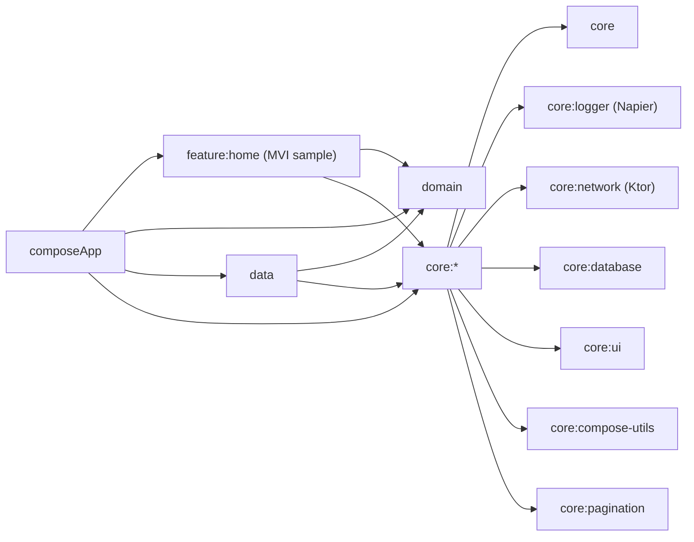
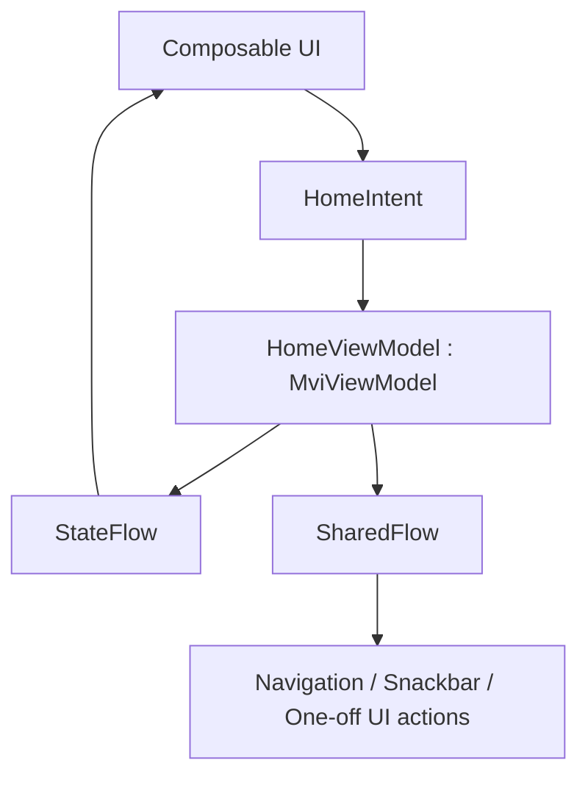

# CMP-Arch Template (Android + iOS)

Production-grade **Compose Multiplatform** starter focused on:
- strict **Clean Architecture**
- reusable **MVI pattern**
- fast feature onboarding with consistent module boundaries

---

## Visual Architecture



### MVI Flow (Template)



---

## Project Structure

```text
CMP-Arch/
├── composeApp/                  # Android+iOS entry points, app navigation, DI bootstrap
├── core/
│   ├── core/                    # Base primitives, MviViewModel, DataStore abstractions
│   ├── logger/                  # AppLogger abstraction + Napier implementation
│   ├── network/                 # Ktor client, auth plugin, mock engine support
│   ├── database/                # Generic template entity store + migration registry
│   ├── ui/                      # Shared loading/error and base UI primitives
│   ├── compose-utils/           # Compose helper modifiers and spacing
│   └── pagination/              # Pagination contracts (Paging3-ready)
├── domain/
│   ├── model/                   # Pure business models
│   ├── repository/              # Repository contracts (interfaces)
│   └── usecase/                 # Use cases / interactors
├── data/
│   ├── local/                   # Local data sources
│   ├── remote/                  # Remote infrastructure (auth refresh etc.)
│   └── repository/              # Repository implementations
├── feature/
│   └── home/                    # MVI sample feature (Intent/State/Effect + ViewModel + Screen)
├── analytics/                   # Analytics abstraction and composition
└── design_system/               # Theme + reusable design components
```

---

## Home Module (MVI Sample Blueprint)

`feature/home` demonstrates exactly how to create a feature:
- define `Intent`, `State`, `Effect` in `HomeContract.kt`
- implement reducer/effect handling in `HomeViewModel.kt`
- render immutable state in `HomeScreen.kt`
- wire DI in `HomeFeatureModule.kt`
- expose nav entry in `HomeNavigation.kt`

Copy this structure to create new features quickly.

---

## Dependency Rules (Enforced)

- `composeApp -> feature + domain + data + core*`
- `feature -> domain + core*`
- `data -> domain + core*`
- `domain -> core`
- `core* -> no dependency on feature/domain/data implementations`

---

## Build

```bash
./gradlew :composeApp:assembleDebug
```

## iOS Run

Open `iosApp` in Xcode and run `iosApp` scheme.

---

## Use As GitHub Template

1. Open repository settings:
   `https://github.com/AshikAzeez/CMP-Template/settings`
2. Enable `Template repository`.
3. Click `Use this template` on the repo page to create a new app.

Detailed bootstrap guide: [docs/github-template.md](docs/github-template.md)
